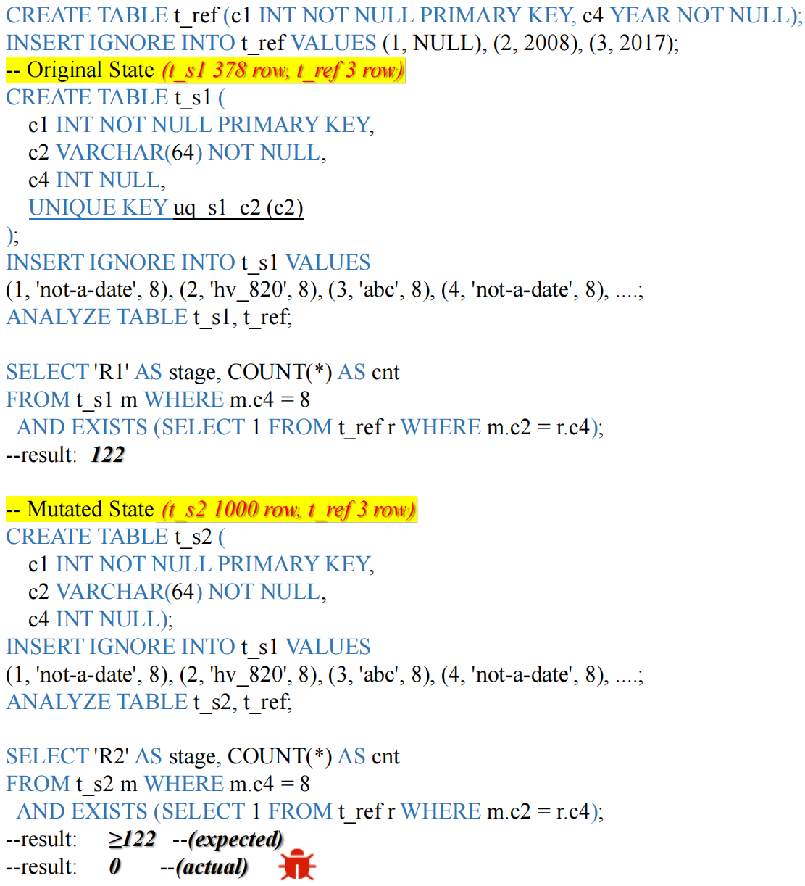

# Case Study: A MySQL Bug Triggered by Admissibility-Based Mutation

Figure 1 in the paper has shown a tuple-based bug triggered by append-only state expansion. Here, we present another confirmed MySQL bug detected by SchemaMorph through admissibility-based mutation.

In the original state, SchemaMorph creates table `t_s1` with a `UNIQUE` constraint on column `c2`. When replaying the generated workload with `INSERT IGNORE`, duplicate `c2` values are rejected, and only 378 rows are admitted. In the mutated state, SchemaMorph relaxes this constraint and replays the same workload, allowing 1,000 rows to be admitted. Thus, the mutated state forms an admissibility-induced over-approximation of the original state.

The bug appears as a violation of the expected monotonicity relation. SchemaMorph applies the same deterministic `EXISTS`-based count query to both states. Since the mutated state admits all tuples accepted by the original state and additional tuples, its query result should be no smaller than that of the original state. However, MySQL returns 122 rows on the original state but 0 rows on the mutated state, causing previously observable matches to disappear. SchemaMorph therefore reports this violation as a state-related logical bug.

Further analysis shows that the violation is caused by a plan-dependent implicit type-conversion error. The query compares `m.c2`, a `VARCHAR` column, with `r.c4`, a `YEAR` column, inside a correlated `EXISTS` subquery. After admissibility-based mutation changes the admitted data scale and state characteristics, MySQL chooses a materialized semijoin path, where the implicit `VARCHAR`-to-`YEAR` coercion is not handled consistently. As a result, strings that should match `YEAR 0000` are incorrectly filtered out, making the over-approximated state return fewer rows.

